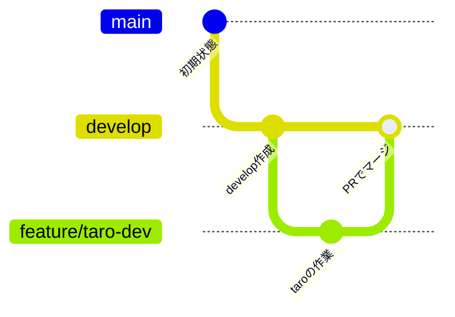

# AI開発ワークショップ

VSCode + Docker + Claude Code（Amazon Bedrock経由）を使って、3時間で小さいアプリを1つ作り切るハンズオンです。
このリポジトリの手順通りに進めれば、環境構築からアプリ制作・GitHubへの提出までを一通り体験できます。

---

## 事前準備（当日までに済ませておくこと）

- [ ] **Git**をインストール済み
- [ ] **Docker Desktop**をインストール済み（https://www.docker.com/products/docker-desktop/）
  - インストール後、一度起動して正常に立ち上がることを確認
  - Windowsの場合、WSL2の案内が出たらその通りに進めればOK
- [ ] **GitHubアカウント**を持っている
- [ ] 運営（講師）からこのリポジトリへの**コラボレーター招待**を受け、承諾済み

心配な場合は、当日早めに来て運営に確認してください。

---

## 事前に用意されているもの（運営から配布）

| 項目 | 例 |
|---|---|
| Bedrock APIキー | `ABSKxxxxxxxxxxxxxxxxxxxxx...` |

⚠️ **APIキーは他人と共有しないでください。** 研修終了後、このキーは無効化されます。

---

## セットアップ手順（当日）

### ステップ1: このリポジトリをclone

作業したい場所（デスクトップなど）で、PowerShell（またはターミナル）を開いて実行します。

```powershell
git clone https://github.com/kikiki-0604/20260821-workshop.git
cd 20260821-workshop
```

### ステップ2: developブランチに切り替えて、自分のブランチを作る

このリポジトリは以下のブランチ構成で運用します。



まず`develop`ブランチに切り替えてから、自分専用のブランチを作ります。**`your-name`の部分は自分の名前やニックネームに書き換えてください。**

```powershell
git checkout develop
git checkout -b feature/your-name-dev
```

（ブランチ名は`feature/your-name-dev`のように統一してください。後ほど成果物を置くフォルダ名もこれに合わせます）

### ステップ3: APIキーを設定する

`.env.example`をコピーして`.env`という名前のファイルを作り、中のAPIキーを書き換えます。

```powershell
Copy-Item .env.example .env
notepad .env
```

開いたメモ帳で、以下の部分を配布されたAPIキーに書き換えて保存してください。

```
AWS_BEARER_TOKEN_BEDROCK=ここにAPIキーを貼り付け
```

### ステップ4: コンテナをビルド＆起動する

```powershell
docker compose up -d --build
```

初回はビルドに数分かかります。

### ステップ5: コンテナの中に入る

```powershell
docker compose exec workshop bash
```

プロンプトが`root@xxxxxxxx:/workspace#`のような表示に変われば成功です。

### ステップ6: Claude Codeを起動する

コンテナの中で、そのまま実行します。

```bash
claude
```

起動画面の一番下に、以下のように表示されていれば成功です。

```
Haiku 4.5 · Amazon Bedrock
```

### ステップ7: 動作確認

```
接続テスト
```

日本語で応答が返ってくれば準備完了です。

---

## 自分専用の作業フォルダを使う

`workspace/`フォルダの中に、**自分のブランチ名と同じ名前のフォルダ**を作って、その中で作業してください（他の人のファイルと混ざらないようにするためです）。

```bash
# コンテナの中で実行
mkdir -p /workspace/your-name-dev
cd /workspace/your-name-dev
```

例：ブランチ名が`feature/taro-dev`なら、フォルダは`workspace/taro-dev/`に作成してください。

ここから`claude`にお願いして、アプリを作っていきます。

---

## お題

**「診断メーカーを作ろう」**

- HTML / CSS / JavaScriptだけで完結するもの（サーバーやデータベースは不要）
- 質問に答えると、結果が表示される形式
- テーマは自由（エンジニアタイプ診断、今日の運勢、社内あるある診断、etc.）

Claude Codeへの最初の指示の例:
```
簡単な診断メーカーをHTML/CSS/JSだけで作りたい。
テーマは「エンジニアタイプ診断」。3〜5問の質問に答えると、
結果として4種類くらいのタイプのどれかが表示される形にしたい。
まずは簡単な構成案を教えて。
```

---

## 完成したら：Pull Requestを出す

コンテナの中で、そのまま以下を実行します。

```bash
git config --global user.name "自分の名前"
git config --global user.email "自分のメールアドレス"

cd /workspace
git add .
git commit -m "your-name: workshop app"
git push origin feature/your-name-dev
```

`git push`実行時にユーザー名とパスワードを聞かれたら、パスワード欄に**GitHubのPersonal Access Token（PAT）**を貼り付けてください（事前準備でまだ発行していない場合は、GitHubの Settings → Developer settings → Personal access tokens から発行できます。対象リポジトリへの`Contents: Read and write`権限があれば十分です）。

push後、GitHub上で以下の手順でPull Requestを作成してください。

1. GitHubのリポジトリページを開く
2. 「Compare & pull request」というボタンが表示されるのでクリック（表示されない場合は「Pull requests」タブ→「New pull request」から）
3. **base: `develop`　←　compare: `feature/your-name-dev`** になっていることを確認
4. タイトルに「〇〇診断メーカー（自分の名前）」のように分かりやすく入力
5. 「Create pull request」をクリック

Pull Requestを出したら、**講師がレビュー・マージを行います。** マージされたら完了です。マージを待たずに発表・共有をしてもらって問題ありません。

以下のようなエラーが出た場合は、コンテナ内で一度だけこれを実行してから再度試してください。

```bash
git config --global --add safe.directory /workspace
```
```
fatal: detected dubious ownership in repository
```

---

## トラブルシューティング

| 症状 | 対処 |
|---|---|
| `docker compose up`でエラーが出る | Docker Desktopが起動しているか確認 |
| `permission_error`や`AccessDenied`が出る | `.env`のAPIキーの入力ミスがないか確認。運営に連絡 |
| `bedrock:CallWithBearerToken`関連のエラー | 運営側のIAM設定の問題です。運営に連絡してください |
| ビルドがすごく遅い | 初回のみ発生。2回目以降は速くなります |
| コンテナから抜けたい | `exit`と入力（コンテナ自体は動き続けます） |
| コンテナに入り直したい | もう一度 `docker compose exec workshop bash` |
| `git push`で認証エラー | パスワード欄にGitHubのパスワードではなくPersonal Access Tokenを入力しているか確認 |

---

## 終了後のお願い

以下を実行して、コンテナごと片付けてください。

```powershell
docker compose down
```

`.env`ファイルはAPIキーが入っているので、ワークショップ終了後に削除しておいてください。

```powershell
Remove-Item .env
```
