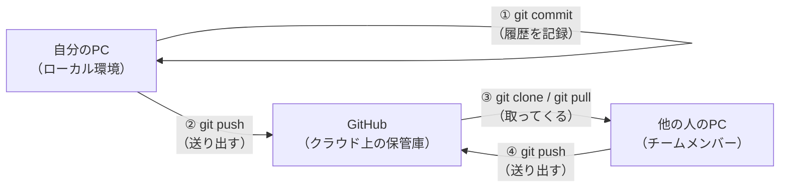
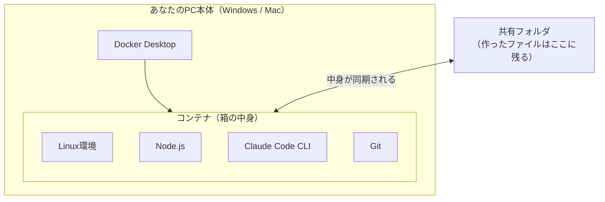
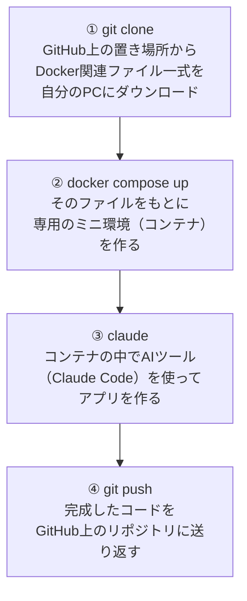

# 予習編：Git・Dockerってそもそも何？

このワークショップでは、GitとDockerという2つの技術を使います。
「聞いたことはあるけど、実はよく分かっていない」という人向けに、当日までに読んでおくと安心な予習編です。

読まなくても当日の手順通りに進めれば動きますが、**「今何をしているか」が分かった方が絶対に楽しい**ので、時間があればぜひ目を通してみてください。

---

## 第1部: Git編

### ① そもそもGitとは何なのか？GitHubとの違いは？

**Gitとは**

Gitは、**ファイルの変更履歴を記録・管理するツール**です。

文章を書くとき、「本文_v1.docx」「本文_v2_修正.docx」「本文_v2_修正_最終.docx」「本文_v2_修正_最終_本当に最終.docx」のようなファイルを作った経験はないでしょうか？ Gitは、これを賢く自動でやってくれる仕組みです。

- いつ、誰が、どこを変更したかを記録できる
- 過去のどの時点にも戻れる
- 複数人で同時に同じファイルを編集しても、うまく統合できる

**GitHubとは**

GitHubは、**Gitの仕組みを使ってファイルの履歴をインターネット上に保存・共有できるサービス**です。

イメージとしては

- **Git** = 履歴を記録する「技術・仕組み」そのもの（自分のPCの中だけでも使える）
- **GitHub** = その履歴を、インターネット上に置いて、みんなで見たり共有したりできる「サービス・場所」

の関係です。似た名前ですが、GitはWordのようなソフトの仕組み、GitHubはGoogleドライブのような置き場所、とイメージすると分かりやすいかもしれません。

> 例えるなら:
> - Git = 「変更履歴を管理できる」という機能そのもの（Wordの「変更履歴の記録」機能に近い）
> - GitHub = その履歴付きファイルを保存・公開できるクラウドサービス（Googleドライブのようなもの）

### 図解: GitとGitHubの関係

- ①：自分のPCの中で、Gitが変更履歴を記録する（インターネット接続は不要）
- ②：その履歴をGitHub（クラウド）に送る＝**push**
- ③：GitHub上のファイルを自分のPCに取ってくる＝**clone**（初回）/ **pull**（更新の取得）
- ④：他の人も同じように、GitHubを介して履歴をやり取りする

今回のワークショップで使う`git clone`・`git push`は、まさにこの図の③④にあたります。

### 表で見るGitとGitHubの違い

| | Git | GitHub |
|---|---|---|
| 正体 | 履歴管理の「仕組み・技術」 | Gitを使ったクラウド「サービス」 |
| どこで動く？ | 自分のPCの中 | インターネット上 |
| インターネット必須？ | 不要（ローカルだけでも使える） | 必要 |
| 例えるなら | Wordの変更履歴機能 | Googleドライブ |

### ② なぜGitを使うべきなのか？

**1. 「壊れても戻せる」という安心感**

コードをいじっていて「あ、動かなくなった...さっきまでは動いてたのに」という経験は、プログラミングをしていると誰でも通る道です。Gitを使っていれば、**いつでも「ちゃんと動いていた時点」に戻せます**。

**2. チームで同時に作業できる**

同じファイルを複数人が同時に編集しても、Gitがうまく統合してくれます（今回のワークショップでも、5人が同じリポジトリを使いますが、各自が別の「ブランチ」を使うことで作業がぶつからないようにしています）。

**3. 「何を、いつ、なぜ変更したか」が記録される**

半年後に見返しても、「このコードはなぜこうなっているんだっけ？」が追跡できます。

**4. 実務では"使えて当たり前"の必須スキル**

ほぼ全てのソフトウェア開発の現場でGitが使われています。今のうちに実際に手を動かして慣れておくことは、そのまま実務での武器になります。

---

## 第2部: Docker編

### ③ Dockerとは何なのか？コンテナとは何なのか？

**「環境構築がめんどくさい」問題**

プログラミングを始めるとき、最初にぶつかる壁が「環境構築」です。

- 「このツールをインストールして」
- 「このバージョンのNode.jsを入れて」
- 「あれ、私のPCだとエラーが出るけど、あなたのPCでは動く...？」

このような「自分のPCでは動くのに、他の人のPCでは動かない」問題は、開発現場で本当によく起きます。原因は、OSの違いや、インストールされているソフトのバージョンの違いなど様々です。

**コンテナという考え方**

Dockerが提供する「コンテナ」は、**「アプリを動かすために必要な環境を、まるごと1つの箱に詰めて、どこでも同じように動かせるようにする技術」**です。

引っ越しの荷造りをイメージしてください。

- 荷物を1つずつ運ぶと、途中でなくしたり、順番を間違えたりするかもしれません
- でも、全部を1つの「コンテナ（輸送用の箱）」に詰めてしまえば、どんなトラックで運んでも、どんな港に着いても、中身は同じ状態で届きます

Dockerのコンテナも同じ考え方です。「必要なソフト・設定・ファイルを全部1つの箱（コンテナ）に詰めて、どのPCで開いても同じように動く」ようにする技術です。

### 図解: コンテナの仕組み

- コンテナの中は、あなたのPCの中身とは**独立した別世界**（コンテナが壊れても、PC本体には影響しません）
- ただし「共有フォルダ」の部分だけは、PC本体とコンテナの両方から見える橋渡し役になっています（＝あなたが作ったコードは、ちゃんとPCにも残ります）
- コンテナを消したいときは`docker compose down`の一言で丸ごと片付けられます

**Docker Desktopとは**

Docker Desktopは、このコンテナを自分のPC上で作ったり動かしたりするための、Windows/Mac向けのアプリケーションです。今回のワークショップでは、これをインストールしてもらいます。

### ④ なぜコンテナ技術が使われるのか？

**1. 「自分のPCでは動くのに...」問題が起きない**

コンテナの中の環境は誰がどこで開いても同じなので、環境の違いによるトラブルが起きません。今回のワークショップでも、Windowsの人もMacの人も、全員が全く同じLinux環境の中で作業することになります。

**2. 自分のPC本体を汚さない**

普段使っているPCに直接いろんなソフトをインストールすると、後で「あのソフト、もう使わないけど消し方が分からない」となりがちです。コンテナの中で作業すれば、**コンテナごと削除するだけで、あなたのPC本体は一切汚れません**。今回のワークショップで「ローカル環境ではなくコンテナを使おう」と決めたのも、まさにこの理由です。

**3. 環境構築の手間が激減する**

普通なら「Node.jsをインストールして、バージョンを合わせて、必要なツールを入れて...」という作業が必要ですが、コンテナなら`docker compose up`のコマンド1つで、必要な環境が全部揃った状態が一瞬で立ち上がります。

**4. 実務でも標準的に使われている**

Webサービスやアプリケーション開発の現場では、Dockerを使った開発が当たり前になっています。今回のワークショップで初めて触れることは、そのまま実務での経験値になります。

---

## まとめ：今回のワークショップで実際に何が起きているか

ここまでの知識を踏まえると、今回のセットアップ手順は、こういうことをやっています。

「よく分からないけどコマンドを打っている」状態から、「今、こういう理由でこれをやっているんだな」と分かった状態で進められると、理解度も当日の楽しさも変わってくるはずです。

---

## 事前準備編に進む

準備ができたら、[README.md](./README.md) のインストール手順・セットアップ手順に進んでください。

① Gitのインストール手順
⑤ Docker Desktopのインストール手順

は次のセクションで案内します。
