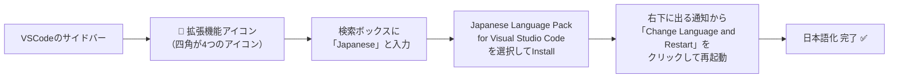

# 事前準備編：Git・Docker Desktopのインストール手順

このワークショップに参加する前に、以下の2つのソフトをインストールしておいてください。
それぞれ5〜15分程度で終わります。

「Git・Dockerって何？」という前提知識は [予習編_Git_Dockerとは.md](./予習編_Git_Dockerとは.md) を参照してください。

---

## ① Gitのインストール手順

### Windowsの場合

1. 以下からインストーラーをダウンロードします。
   https://git-scm.com/download/win

2. ダウンロードした`.exe`ファイルをダブルクリックして起動します。

3. インストールウィザードが始まります。基本的には**すべて「Next」でデフォルト設定のまま進めて問題ありません**。迷ったら以下だけ意識してください。
   - 「Select Components」画面：デフォルトのままでOK
   - 「Choosing the default editor used by Git」画面：分からなければデフォルト（Vim）のままでOK。使い慣れたエディタがあれば選択
   - 「Adjusting your PATH environment」画面：**推奨設定（Recommended）のまま**進める

4. インストール完了後、**新しく**PowerShell（またはコマンドプロンプト）を開いて、以下を実行します。

```powershell
git --version
```

`git version 2.xx.x`のようにバージョンが表示されれば成功です。

### Macの場合

1. ターミナルを開いて、以下を実行します。

```bash
git --version
```

すでにインストールされている場合はバージョンが表示されます。もし入っていなければ、インストールを促すダイアログが出るので、その指示に従ってインストールしてください（Xcode Command Line Toolsが自動でインストールされます）。

または、Homebrewが入っている場合は以下でもインストールできます。

```bash
brew install git
```

---

## ② Gitの初期設定（インストール後、一度だけ）

インストールできたら、自分の名前とメールアドレスを設定しておきます（これはコードの変更履歴に「誰が変更したか」を記録するためのものです）。

```powershell
git config --global user.name "自分の名前"
git config --global user.email "自分のメールアドレス"
```

例:
```powershell
git config --global user.name "Taro Yamada"
git config --global user.email "taro.yamada@example.com"
```

---

## ③ Docker Desktopのインストール手順

### Windowsの場合

1. 以下からダウンロードします。
   https://www.docker.com/products/docker-desktop/

2. 「Download for Windows」をクリックしてインストーラーをダウンロードします。

3. ダウンロードした`Docker Desktop Installer.exe`を実行します。

4. インストール中に「Use WSL 2 instead of Hyper-V」というチェックボックスが出た場合は、**チェックを入れたまま**進めてください（推奨設定です）。

5. インストール完了後、PCの**再起動を求められることがあります**。指示が出たら再起動してください。

6. 再起動後、Docker Desktopを起動します（スタートメニューから「Docker Desktop」を検索）。

7. 初回起動時に利用規約への同意を求められるので、同意して進めます。アカウント作成やログインを求められることがありますが、**スキップ可能な場合はスキップして問題ありません**。

8. 画面下部（またはシステムトレイ）のDockerアイコンが「緑色」または「Docker Desktop is running」の表示になれば起動完了です。

9. 起動できたら、PowerShellで以下を実行して確認します。

```powershell
docker --version
```

バージョンが表示されれば成功です。

### Macの場合

1. 以下からダウンロードします（Mac のチップがApple SiliconかIntelかで選択肢が変わります。分からない場合は画面左上の`りんごマーク → このMacについて`で確認できます）。
   https://www.docker.com/products/docker-desktop/

2. ダウンロードした`.dmg`ファイルを開き、Docker.appをApplicationsフォルダにドラッグします。

3. Applicationsフォルダから Docker.app を起動します。

4. 初回起動時、システム権限の許可を求められることがあるので許可します。

5. 起動できたら、ターミナルで以下を実行して確認します。

```bash
docker --version
```

---

## ④ VSCodeの日本語化（拡張機能のインストール）

VSCodeは初期状態だと英語表示です。日本語化しておくと、当日の作業がぐっと分かりやすくなります。

### 手順

1. VSCodeを起動します
2. 画面左側の縦に並んだアイコンの中から、四角が4つ並んだようなアイコン（**拡張機能**）をクリックします



3. 検索ボックスに`Japanese`または`日本語`と入力します
4. 検索結果の一番上あたりに出てくる **「Japanese Language Pack for Visual Studio Code」**（発行元: Microsoft）を選択します
5. **「Install」**ボタンをクリックします
6. インストール完了後、画面右下に「Change Language and Restart」という通知が出るので、それをクリックします
7. VSCodeが自動的に再起動し、日本語表示に変わります

### 確認方法

再起動後、メニューバーなどが日本語（「ファイル」「編集」「表示」など）になっていれば成功です。

もし日本語化されない場合は、`Ctrl + Shift + P`でコマンドパレットを開き、`Configure Display Language`と入力して`ja`（日本語）を選択してください。

---

## うまくいかない場合

### Windows: 「WSL 2のインストールが必要です」と表示される

Docker Desktopの指示に従って、WSL2のインストールを進めてください。多くの場合、以下のコマンドをPowerShell（管理者として実行）で打つだけで解決します。

```powershell
wsl --install
```

実行後、PCを再起動してから、もう一度Docker Desktopを起動してください。

### Windows: Docker Desktopが起動しない・エラーが出る

- 会社支給のPCの場合、**管理者権限がなくインストールできない**ケースがあります。その場合は、社内のIT部門・情報システム部門に相談してください
- Hyper-VやWSL2に関する設定が、社内セキュリティポリシーで無効化されている場合もあります

### 心配な人へ

このインストール作業は、当日ではなく**できるだけ数日前に済ませておく**ことを強くおすすめします。特に会社PCは、社内ポリシーの制限で時間がかかることがあるためです。

うまくいかない場合は、遠慮なく運営（講師）に事前に連絡してください。

---

## インストールできたら

以下2つのコマンドがどちらもエラーなく実行できれば準備完了です。

```powershell
git --version
docker --version
```

チェックリスト:
- [ ] `git --version`でバージョンが表示される
- [ ] `docker --version`でバージョンが表示される
- [ ] Docker Desktopが起動している（緑色のアイコン）
- [ ] VSCodeが日本語表示になっている

準備ができたら、[README.md](./README.md) の当日のセットアップ手順に進んでください。
